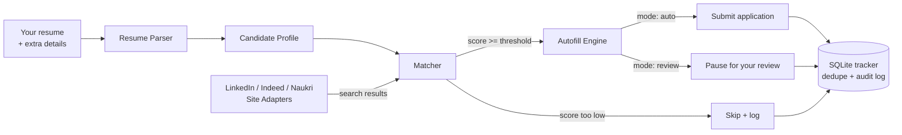

# AI Job Agent

An autonomous agent that applies to jobs on your behalf. Give it your resume and a few extra
details once, point it at LinkedIn, Indeed, and Naukri, and it searches for matching roles,
scores each one against your actual background with an LLM, fills out the application form, and
(depending on how you configure it) submits it — logging everything it does to a local database
so you always have a full audit trail.

> **Status:** portfolio / personal-automation project. It's fully wired end-to-end, but job sites
> change their HTML often and run anti-bot detection, so treat the CSS selectors in `src/sites/*`
> as a solid starting point you'll periodically need to adjust — see
> [Maintenance](#maintenance--known-limitations) below.

## How it works



1. **Resume Parser** (`src/resume_parser.py`) reads your PDF/DOCX/TXT resume and — using an LLM —
   turns it into a structured `CandidateProfile` (skills, work history, education, years of
   experience). Any extra details you want the agent to know that aren't in your resume (desired
   salary, visa status, notice period, etc.) get merged in too.
2. **Site Adapters** (`src/sites/linkedin.py`, `indeed.py`, `naukri.py`) log into each site with
   Playwright and search for jobs matching the titles/locations in `config.yaml`.
3. **Matcher** (`src/matcher.py`) first runs cheap keyword filters (exclude "unpaid", require
   "remote", etc.), then asks Gemini (Google's free-tier LLM) to score how good a fit each remaining job actually is
   against your real resume — not just keyword overlap.
4. **Autofill Engine** (`src/autofill.py`) is the one piece of form-filling logic shared by all
   three site adapters. It finds every field on the application form, answers the obvious ones
   directly from your profile (name, email, phone, resume upload), and asks the LLM to answer
   anything open-ended ("Why do you want to work here?", screening questions) using your resume
   as grounding.
5. **Tracker** (`src/tracker.py`) records every job the agent looked at — matched or skipped,
   submitted or failed — in a local SQLite database, and makes sure it never applies to the same
   posting twice.

## Quick start

```bash
git clone <this-repo>
cd ai-job-agent
python3 -m venv .venv && source .venv/bin/activate
pip install -r requirements.txt
playwright install chromium

cp .env.example .env
# edit .env: add your free GEMINI_API_KEY (get one at https://aistudio.google.com/apikey)
# — leave the LinkedIn/Indeed/Naukri fields blank, see "Logging in" below

mkdir -p resumes && cp /path/to/your/resume.pdf resumes/resume.pdf

# sanity-check that resume parsing worked before trusting it with anything else
python main.py show-profile

# edit config.yaml: job titles, locations, and how you want `apply.mode` to behave
python main.py apply --dry-run     # fills forms but never submits, for a first test run
python main.py apply               # the real thing, per your config.yaml
```

### Logging in (Google sign-in works fine)

The first time you run `apply`, a real Chromium window opens on each enabled site's login page
and the terminal prints something like `[linkedin] A browser window is open on the login page.
Please log in there yourself...` — then just log in normally in that window. If you use "Continue
with Google" for LinkedIn/Indeed/Naukri, that's exactly what you'd click here too; the agent never
touches your Google credentials or tries to automate that step. Handle any 2FA or CAPTCHA the same
way you always would, then switch back to the terminal and hit Enter to let the agent continue.

Each site gets its own persistent browser profile under `data/browser_profile/`, so that session
gets saved to disk and reused automatically on every future run — you should only need to do this
manual login once per site, not once per run. (Automating Google/Microsoft's own sign-in page with
a typed-in password is specifically the pattern their bot detection is built to catch, and getting
flagged there risks your actual Google account — not just the job site — so this project
deliberately never attempts it.)

## Configuration

Everything day-to-day lives in `config.yaml` — search criteria, which sites are enabled, the
match-score threshold, and how applications get submitted. Secrets (API key, site passwords) go
in `.env` (see `.env.example`), never in `config.yaml`, and `.env` is already git-ignored.

Key settings worth knowing about in `config.yaml`:

| Setting | What it does |
|---|---|
| `matching.min_match_score` | Jobs scoring below this (0–100, judged by the LLM against your resume) are skipped entirely and never opened for application. |
| `apply.mode` | `"auto"` clicks the final submit button itself. `"review"` fills the form and stops, leaving the browser open for you to check and click submit yourself. |
| `apply.dry_run` | Fills forms but never submits, regardless of `mode` — the safe way to test a new config. |
| `apply.max_applications_per_run` / `max_applications_per_day` | Hard caps so a bug (or an overly broad search) can't fire off hundreds of applications unattended. |
| `apply.delay_between_applications_seconds` | Randomized pause between applications so behavior looks less like a bot firing on a timer. |
| `sites.linkedin.easy_apply_only` | Only attempts LinkedIn's in-platform "Easy Apply" flow; postings that redirect to an external company ATS are skipped, since those forms are too varied to fill generically. |
| `browser.headless` | Keep `false` at first — you'll need a visible browser window for the one-time manual login (see above) and to solve any CAPTCHA/2FA challenge that comes up. |

## Safety & Terms of Service — read this before using `apply.mode: auto`

LinkedIn, Indeed, and Naukri's Terms of Service prohibit automated/bot access to their platforms.
This project drives a real, logged-in browser session as if it were you clicking around, using
**your own** credentials for **your own** job search — but the platforms can still detect
automated behavior and act on it (CAPTCHAs, rate limits, temporary or permanent account
restrictions). That risk is entirely yours to accept as the account owner; this project doesn't
mitigate it, it just tries not to make it worse (randomized delays, a low daily application cap,
a headed browser by default so you can intervene). A few concrete recommendations:

- Start with `apply.mode: review` and/or `apply.dry_run: true` until you trust what it's doing.
- Keep `max_applications_per_day` low (20–30 is plenty for a real job search).
- Don't run it fully unattended against `mode: auto` on day one — watch the first several runs.
- If a site shows you a CAPTCHA or 2FA prompt, the adapters pause and wait for you to solve it in
  the browser window rather than trying to bypass it.

## Project structure

```
ai-job-agent/
├── main.py                  # CLI entrypoint (apply / show-profile commands)
├── config.yaml               # search criteria, site toggles, apply behavior
├── .env.example               # template for API key + site credentials
├── src/
│   ├── models.py             # shared data classes: CandidateProfile, JobPosting, etc.
│   ├── resume_parser.py       # PDF/DOCX/TXT -> structured CandidateProfile
│   ├── llm.py                 # all Gemini API calls live here (free tier)
│   ├── matcher.py              # keyword filters + LLM match scoring
│   ├── autofill.py             # generic form-filling engine used by every adapter
│   ├── tracker.py              # SQLite dedupe + audit log
│   └── sites/
│       ├── base.py             # SiteAdapter interface every site implements
│       ├── linkedin.py
│       ├── indeed.py
│       └── naukri.py
├── tests/                     # pytest unit tests (resume parsing, matching, tracker)
└── resumes/                   # put your resume here (git-ignored)
```

## Adding a new site

Every site adapter implements the same three methods
(`login`, `search_jobs`, `apply` — see `src/sites/base.py`), and the whole autofill/matching
pipeline is site-agnostic. To add e.g. Glassdoor or Wellfound: create
`src/sites/glassdoor.py`, subclass `SiteAdapter`, implement those three methods (see
`src/sites/naukri.py` for the smallest example to copy from), register it in
`SITE_ADAPTERS` in `main.py`, and add its config block to `config.yaml`.

## Testing

```bash
pip install -r requirements.txt   # includes pytest
pytest
```

Tests cover resume parsing (including the regex-only fallback when no LLM is configured),
keyword-filter and match-evaluation logic, and the SQLite tracker's dedupe behavior — none of
them make real network calls or need live site credentials, so they run anywhere.

## Maintenance & known limitations

- **Selectors will break.** LinkedIn/Indeed/Naukri redesign their pages periodically. If
  `search_jobs` or `apply` stops finding elements, open the page, inspect the current DOM, and
  update the CSS selectors in the relevant `src/sites/*.py` file.
- **CAPTCHAs and 2FA are not solved automatically.** The agent pauses and waits for a human when
  it detects one — by design, not as a missing feature.
- **Non-Easy-Apply / external ATS postings are skipped.** Company-hosted application forms vary
  too much to fill reliably and safely with one generic engine.
- **The LLM match score is only as good as the resume parse.** Run `python main.py show-profile`
  after any resume update to confirm parsing looks right before trusting the agent to act on it.

## License

MIT — see [LICENSE](LICENSE).
